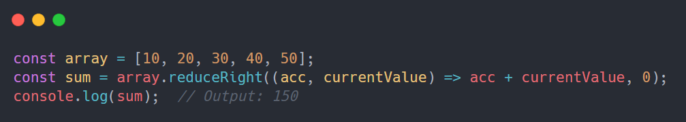
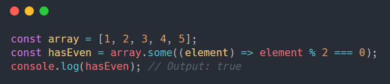
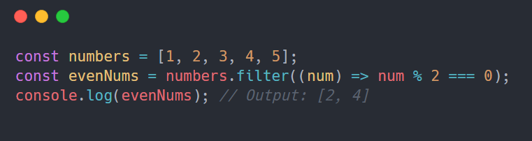
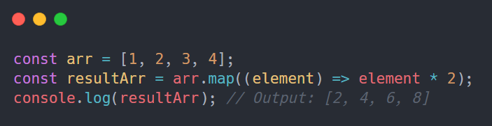
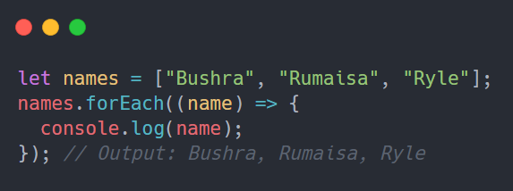
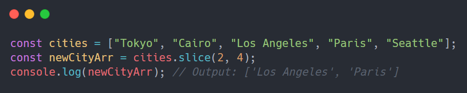
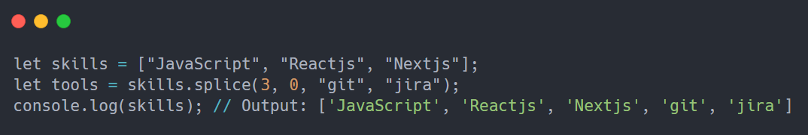
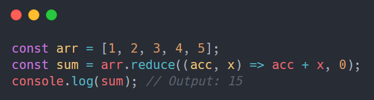

# JavaScript Array Methods

## JavaScript Array reduceRight() Method

The reduceRight() method in JavaScript is used to convert elements of
the given array from right to left to a single value.

Note − If the current array is empty or doesn't contain any initialValue, this method will
throw a 'TypeError' exception.

## JavaScript Array some() Method

The some() method performs testing and checks if atleast a single array element passes the test,
implemented by the provided function. If the test is passed, it returns true. Else, returns false.

Note: If some() method is applied on an empty array, it returns false always.

## JavaScript Array filter() Method

The filter() method doesn't modify the original array, but instead returns a new array
containing only the elements that meet the specified condition.

## JavaScript Array map() Method

The map() method in JavaScript is a higher-order function that creates a new array by applying a function to each element of the original array. Used it when you want to transform the array.

## JavaScript Array forEach() Method

The forEach() method executes a function for each array element but doesn't return a new array.
Typically used for side effects like logging or modifying external variables.

## JavaScript Array slice() Method

The slice() method returns selected elements in an array as a new array. It selects from a given start, up to a (not inclusive) given end. It doesn't alter the original array but instead creates a shallow copy.

## JavaScript Array splice() Method

The splice() Method in JavaScript is used to change the contents of an array by removing or replacing existing elements and/or adding new elements. It modifies the original array and returns an array of the removed elements.

## JavaScript Array reduce() Method

The reduce() method iterates over an array, applying a reducer function to each element, accumulating a single output value. It takes an initial value and processes elements from left to right, reducing the array to a single result.

